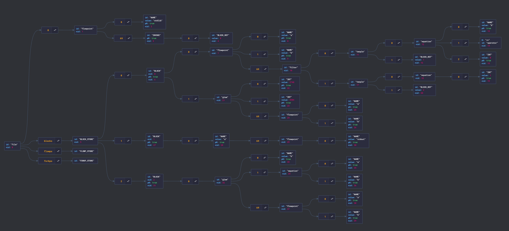

Wence:  a Functional Programming Lannguage
Wither: a Declarative Language for parsing

WIP

usage: `python3.10 main.py wence.wi <source>`

This runs the wither interpreter using the given grammer to produce a wence tree (also, phase 0 of compilation is performed, some trivial node folding and such)

e.g. `euclid.we` produces

