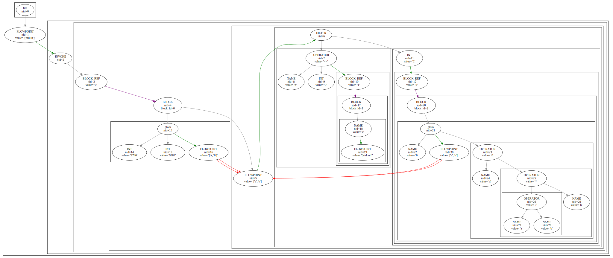

Wence:  a Dataflow Programming Lannguage

Wither: a Declarative Language for parsing

WIP - Please begin by reading [Language.md](Language.md)

usage: `python3.10 main.py wence.wi <in: *.we> <out: *.dot>`

This runs the wither interpreter and wence compiler using the given grammer and wence source to produce a wence tree

e.g. `euclid.we` produces

Known issues:
if you make a typo/use invalid syntax the output graph will usually just be empty or it'll throw an obtuse error

Quicksort implementation likely would not work. As written, it implies a temporal constraint imposed by the order of statements within a block, which is not the case. Statements can be executed simultaneously or in any order. The quicksort implementation largely serves as a stress test for compilation as it exercises the much of the complexity of the language, and the graph can be examined as if statements executed in order to determine correctness of compilation.

Graphviz clustering isn't perfect. Currently `this` and `lift` (at least) wind up at the wrong depth in the clustering, and sometimes `BLOCK_REF` can fail to nest properly at all - the actual edges are accurate, though.
